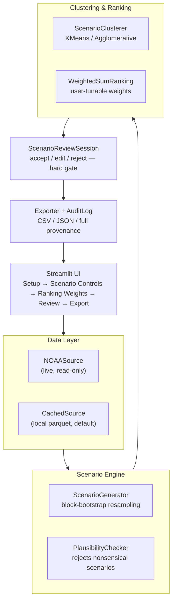

# BASIN

**Basin Analysis and Scenario Intelligence Navigator**

A locally-run decision-support tool that generates transparent, auditable, rainfall-based "what if" drought scenarios for the source areas feeding the Corpus Christi / Region N regional water supply system.

Built for **From The Ground Up** — Region N (Coastal Bend) Water Resource Management Track.


---

## What BASIN Is

Water providers in Region N plan against a single historical drought-of-record. BASIN doesn't try to replace that hydrologic model — it generates hundreds of ranked, clustered rainfall-stress scenarios so a planner can explore *"what if the next drought is worse, longer, or hits multiple source basins at once?"* before committing to a plan.

Every number in every scenario is traceable back to a real calculation. Nothing is asserted; everything is exportable and auditable.

### What BASIN is not

- ❌ Not a hydrologic yield or reservoir-level model
- ❌ Not a restriction-date predictor
- ❌ Not a verdict engine — it never says "this will happen," only "here is a plausible scenario, ranked and labeled"
- ❌ No cloud inference, no live utility SCADA integration, no user accounts

## Design Constraints

These aren't aspirational — they're structural requirements the codebase is built to enforce, not just claim:

| Constraint | How it's enforced |
|---|---|
| Runs on a single laptop, no cloud inference | Local Python process; only network call is a cacheable NOAA pull |
| Full run completes in minutes | Measured and logged via `RunFootprint`, not asserted in prose |
| No verdict field, anywhere | Structurally absent from `Scenario.to_audit_record()` and the exporter — there's no field for it |
| Every parameter, score, and selection reason is auditable | Full run history written to `audit_log.json` |
| User-controlled ranking weights | Strategy-pattern ranking, not a hardcoded formula |
| User can reject, edit, or replace any scenario before export | Mandatory human review gate — the Export screen is disabled until every scenario has been reviewed |
| Provider-specific notes stay local by default | `LocalNotesStore` — local JSON, never transmitted unless the user explicitly opts in |
| Honest environmental accounting | `RunFootprint` measures wall-clock time, network calls, and memory on every run |
| Interoperable export | CSV + JSON, no proprietary lock-in |

## How It Works



Offline is the **default** data path, not a fallback — the bundled cached snapshot is what runs during the demo and in the field. Live NOAA fetch is a team-only, ahead-of-time step to refresh that snapshot; it's never called live during a demo.

### Where AI/ML actually lives

| Component | Technique | AI/ML? |
|---|---|---|
| Scenario generation | Block-bootstrap resampling | No — statistical simulation |
| Feature extraction | Deterministic calculation | No |
| **Clustering** | **KMeans / Agglomerative** | **Yes — unsupervised ML** |
| Ranking | Weighted-sum scoring | No — deliberately deterministic |
| Plausibility checking | Rule-based bounds checks | No |
| Explanations | Template substitution over real values | No — never LLM-generated free text |
| *(stretch)* Hydrologist chat agent | Local small LLM + constrained tool-calling | Yes |

Clustering alone satisfies the "small, purpose-trained, locally-run models over large general-purpose systems" principle. Every other stage is intentionally plain computation — auditability over sophistication.

## Tech Stack

| Layer | Choice |
|---|---|
| Language | Python 3.11 |
| UI | Streamlit |
| Data handling | pandas, numpy |
| Clustering | scikit-learn |
| Data source | NOAA NCEI GHCN-Daily API, cached locally as parquet |
| Export | CSV + JSON |

## Project Structure

```
basin/
├── app.py
├── data/           # PrecipitationSource, NOAASource, CachedSource, station registry
├── engine/         # Scenario, ScenarioGenerator, FeatureExtractor
├── analysis/       # ScenarioClusterer, RankingStrategy, explain.py
├── review/         # ScenarioReviewSession — the human override gate
├── plausibility/   # PlausibilityChecker, PlausibilityReport
├── storage/        # LocalNotesStore
├── export/         # Exporter, AuditLog, RunFootprint
├── tests/
└── docs/
    ├── ai_use_log.md
    └── validation_notes.md
```

## Status

This project is under active development for the hackathon build sprint. Nothing is implemented yet — this repo currently reflects the design phase.

- [ ] Core pipeline (`data` → `engine` → `analysis` → `review` → `export`) running end-to-end from a script
- [ ] Streamlit UI, all 5 screens
- [ ] Plausibility + review test coverage
- [ ] Validation feedback from TAMUCC / NRA / HDR incorporated
- [ ] *(stretch, gated on the above)* Local LLM chat agent for natural-language queries over an already-reviewed shortlist

## Team

Mohammed Khan, Misha, and Noah — Finalists, From The Ground Up Hackathon.

## Full Design

The complete technical design document — object model, plausibility checks, agentic safety guardrails, and open validation questions — lives with the team and drives this build.
