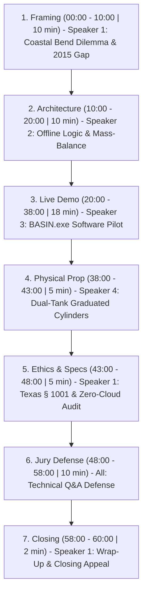

# BASIN: 60-Minute Finalist Showcase Presentation Plan & Runbook

**Event:** *From the Ground Up 2026 AI Hackathon — Finalist Showcase*  
**Location:** Pleasanton, CA  
**Date:** September 22, 2026  
**Institution:** Texas A&M University-Corpus Christi  
**Project:** BASIN (*Basin Analysis and Scenario Intelligence Navigator*)  
**Format:** 60-Minute Total Block (45-Minute Pitch + Live Demo + Physical Prop, 12-Minute Jury Defense/Q&A, 3-Minute Buffer/Wrap)

---

## Speaker Roles & Responsibilities (Template)
*Customize these assignments to match your team's roster:*

| Role | Default Assignment | Key Responsibilities |
| :--- | :--- | :--- |
| **Speaker 1: Team Lead / Policy** | `[Member Name 1]` | Opening hook, Texas Region N problem framing, community stakes, § 1001 engineering ethics, wrap-up. |
| **Speaker 2: Lead Hydrologist** | `[Member Name 2]` | Meteorological baseline, NOAA station proxies, Mary Rhodes pipeline, reservoir mass balance, climate warming pan evaporation. |
| **Speaker 3: Systems & ML Engineer** | `[Member Name 3]` | Live software pilot in `BASIN.exe`, K-Means clustering, AI data center cooling stressor, verified WAM export. |
| **Speaker 4: Physical Simulation / Prop Lead** | `[Member Name 4]` | Choreographing the dual-tank graduated cylinder physical demonstration, synchronizing physical water levels with on-screen triggers. |

---

## Master Time-Block Schedule (60 Minutes)



---

## Detailed Minute-by-Minute Segment Runbook

### Segment 1: The Crisis, The Gap, and The Stakes [00:00 – 10:00 | 10 min]
**Lead Speaker:** `[Speaker 1: Team Lead / Policy]`  
**Visual Support:** Title Slide / Region N Drought Map Slide

#### Minute-by-Minute Flow:
* **00:00 – 02:00 | The Hook & Introductions:**
  - Introduce the team from Texas A&M University-Corpus Christi.
  - State the opening challenge: *"In South Texas, water is not an abstract environmental debate; it is an existential economic constraint. In the Texas Coastal Bend (Region N), 600,000 residents and industrial hubs depend on two interconnected reservoirs: Lake Corpus Christi and Choke Canyon Reservoir."*
* **02:00 – 05:00 | The 2015 Hydrology Blind Spot:**
  - Explain why existing planning is outdated: Official state water availability models (Texas WAM Run 3) stop at **2015 hydrology** because commissioning full engineering consulting runs costs hundreds of thousands of dollars and takes 6 to 18 months.
  - Small rural water districts (like Nueces County WCID #3) cannot afford custom engineering contracts for preliminary scoping.
* **05:00 – 08:00 | The Compound Triple-Threat (Drought + Climate + AI):**
  - **Meteorological Drought:** Long-duration rainfall deficits.
  - **Global Warming:** South Texas summer temperatures exceeding 100°F drive pan evaporation to 8–10 inches/month, losing more water to the sky than municipal water taps draw.
  - **AI & Industrial Expansion:** Hyperscale data centers and semiconductor manufacturing expanding along the I-37 corridor rely on evaporative cooling towers consuming millions of gallons of potable water daily.
* **08:00 – 10:00 | The Solution Thesis (BASIN):**
  - Introducing **BASIN**: A 100% offline, local pre-engineering scoping workbench that lets water managers stress-test 35 years of unmanipulated NOAA observations in seconds, without cloud bills, API tokens, or synthetic hallucinations.

---

### Segment 2: Hydrologic Architecture & Methodology [10:00 – 20:00 | 10 min]
**Lead Speaker:** `[Speaker 2: Lead Hydrologist]`  
**Visual Support:** Architecture Diagram / Hydrology Methodology Slide

#### Minute-by-Minute Flow:
* **10:00 – 13:00 | Observational Integrity & Zero Synthetic Hallucinations:**
  - Show why Generative LLMs should *never* generate synthetic weather sequences for civil infrastructure.
  - BASIN uses **Synchronized Historical Window Resampling**: Extracting real multi-station 30-day to 365-day storm windows from 1991–2025 NOAA GHCN-Daily records. Storm tracks, seasonal concurrence, and spatial correlations are preserved intact.
  - Cryptographic data provenance: Every station snapshot is SHA-256 hashed. Missing records are preserved as true missing values, never silently imputed with zero.
* **13:00 – 16:00 | Unsupervised K-Means Morphological Profiling:**
  - How BASIN handles 300 to 1,000 resampled drought candidates:
  - Normalized 4D feature vectors: Duration, deficit severity, dry-spell run length, and multi-basin concurrence.
  - Deterministic K-Means clustering assigns explainable profiles (e.g., *"Peak Summer Elevated Deficit"* vs. *"Multi-Basin Concurrent Deficit"*).
  - Diverse selector algorithm guarantees representation across all clusters on the shortlist, eliminating single-mode "groupthink" selection.
* **16:00 – 20:00 | Physical Mass-Balance Governing Equations:**
  - Explain the dual-tank reservoir system:
    - **Lake Corpus Christi (LCC):** 257,300 ac-ft terminal pool (Nueces River).
    - **Choke Canyon Reservoir (CCR):** 662,600 ac-ft carryover pool (Frio River).
    - **Combined Pool:** 919,900 ac-ft.
  - Net daily storage balance:
    $$\Delta S = \text{Catchment Inflow} - \text{Evaporative Loss} - \text{Municipal Draw} - \text{Data Center Cooling Draw}$$
  - Drought Contingency Plan (DCP) triggers:
    - Stage 1 (Mild Drought): Combined $< 40\%$ (367,960 ac-ft)
    - Stage 2 (Moderate Drought): Combined $< 30\%$ (275,970 ac-ft)
    - Stage 3 (Critical / Mandatory Cutbacks): Combined $< 20\%$ (183,980 ac-ft)

---

### Segment 3: Live Software Pilot in BASIN.exe [20:00 – 38:00 | 18 min]
**Lead Pilot:** `[Speaker 3: Systems & ML Engineer]`  
**Co-Narrators:** `[Speaker 1 & Speaker 2]`  
**Display:** Live Native Desktop Window (`BASIN.exe` projected in full 1080p/4K)

#### Live Demo Choreography (Step-by-Step Screen Actions):

* **20:00 – 23:00 | Action 1: Data View & GIS Infrastructure Map**
  - `[CLICK: View -> Data]`
  - Highlight the South Texas Basin Map: Point out Corpus Christi (USW00012924), Victoria (USW00012912), and San Antonio (USW00012921).
  - Trace the **Mary Rhodes Phase 1 Pipeline**: The 101-mile raw water aqueduct delivering 60 MGD from Lake Texana directly to O.N. Stevens Water Treatment Plant.
  - Show the **I-37 Industrial Corridor**: Highlight where power and data center infrastructure is expanding.
  - Verify data integrity: Point to the SHA-256 snapshot checksum and station completeness percentages.

* **23:00 – 26:00 | Action 2: Sidebar Scenario Generation & Community Presets**
  - `[CLICK: View -> Workspace]`
  - `[SIDEBAR: Open 'New run']`: Show multi-station selection, durations (90, 180, 270 days), 35%–85% rainfall retention, 300 candidates, seed 22.
  - `[CLICK: 'Generate']`: The 300-candidate scenario workspace compiles in under 1.2 seconds locally.
  - `[SIDEBAR: Open 'Ranking weights']`:
    - Select **"Rural Water District (Nueces County WCID #3)"**: Watch the sliders automatically snap to 50% Jun–Sep summer crop timing.
    - Select **"River Basin Authority"**: Watch weights snap to 40% multi-basin concurrence.
    - Show real-time re-ranking of all 300 candidates.

* **26:00 – 29:00 | Action 3: Workspace Candidate Table & Feature Clustering**
  - Hover over the 2D feature scatterplot (Days vs. Deficit mm colored by K-Means cluster).
  - Point to the candidate table: Show how the diverse selector ensured that Group 0, Group 1, Group 2, etc. all have representatives shortlisted.
  - Select candidate row 1: Click **"Inspect [ID]"** to transition to the Review view.

* **29:00 – 33:00 | Action 4: Physical Reservoir Simulation & Real-Time Playback**
  - `[CLICK: Series -> 'Reservoir simulation']`
  - Explain the dual-tank interface: Left bar shows active storage in LCC & CCR; right line shows cumulative percentage trajectory.
  - Set playback pace to **"Rapid preview (10 sec)"** or **"Deliberate (45 sec)"**.
  - `[CLICK: '▶ Play Simulation']`: Let the audience watch the gauge drain day-by-day.
  - Note the exact day when storage crosses the **Stage 1 (40%)** and **Stage 2 (30%)** threshold lines!

* **33:00 – 36:00 | Action 5: The Climate & AI Data Center Stressor Test**
  - Open the **"🌡️ Climate Warming & Data Center Demand Stressors"** expander.
  - Narrate: *"Now, let's see what happens if global warming intensifies summer heat by +2.0°C and a new hyperscale AI data center cluster adds 8 MGD of evaporative cooling demand."*
  - `[SLIDER: Global warming anomaly -> +2.0°C]`
  - `[SLIDER: AI data center cooling -> 8.0 MGD]`
  - **The Climax Metric:** Point directly to the red deltas:
    > **Stage 2 Breach (<30%): Day 142 (↓ 38 days earlier!)**
  - Emphasize to the judges: *"This single stress test gives water boards quantitative proof of how AI infrastructure accelerates municipal drought curfews."*

* **36:00 – 38:00 | Action 6: Human Engineering Sign-Off (§ 1001) & Verified WAM Export**
  - In the right column, demonstrate practitioner control:
    - Add review note: `"Evaluated under +8 MGD industrial cooling load; accepted for baseline firm yield review."`
    - `[CLICK: 'Accept']`: Show status change to `accepted` and revision locking.
    - Demonstrate multiplier scaling or daily value editor. Show that modifying a single daily value clears approval and increments revision, strictly enforcing audit provenance.
  - `[CLICK: View -> Exports]`
  - `[CLICK: 'Build verified export']`: Packages `rainfall.csv`, `shortlist.csv`, `audit.json`, and `Hydrologist_Handoff_Brief.md`.
  - Download and open the ZIP: Show the Texas WAM Run 3 translation brief ready for professional engineers.

---

### Segment 4: Physical Element & Prop Synchronization [38:00 – 43:00 | 5 min]
**Lead Demonstrator:** `[Speaker 4: Physical Simulation / Prop Lead]`  
**Co-Narrator:** `[Speaker 2: Lead Hydrologist]`  
**Prop Apparatus:** Two Clear Graduated Cylinders (labeled LCC and CCR), colored water, siphon tube with control valve, and demand/evaporation discharge beakers.

#### Prop Demonstration Choreography:
1. **The Setup (Before presentation starts):**
   - Cylinder 1: Labeled **Lake Corpus Christi (LCC)** filled to 257 mL (representing 257k ac-ft).
   - Cylinder 2: Labeled **Choke Canyon Reservoir (CCR)** filled to 662 mL (representing 662k ac-ft).
   - Prominent colored marker rings at **40% (Stage 1)** and **30% (Stage 2)** combined volume.
2. **The Demonstration (38:00 – 41:00):**
   - Speaker 4 opens the baseline municipal valve: Water flows steadily out (representing the 180 MGD city draw).
   - Speaker 4 introduces the second siphon tube: *"This is summer pan evaporation under a +2.0°C heatwave."*
   - Speaker 4 introduces the third siphon tube: *"This is the 8 MGD evaporative cooling load from the AI data center."*
3. **The Punchline (41:00 – 43:00):**
   - Watch the water level rapidly drop past the yellow 40% Stage 1 line and plunge toward the red 30% Stage 2 line.
   - Point to the software screen simultaneously: *"Notice how our physical cylinder hits the Stage 2 line at the exact moment BASIN's simulation hits Day 142. The physical prop proves the mass-conservation fidelity of our deterministic code."*

---

### Segment 5: Ethics, Texas Law (§ 1001), & Zero-Cloud Audit [43:00 – 48:00 | 5 min]
**Lead Speaker:** `[Speaker 1: Team Lead / Policy]`  
**Visual Support:** Legal / Ethical Compliance Slide

#### Key Arguments to Deliver:
* **Texas Engineering Practice Act (§ 1001) Compliance:**
  - AI does *not* make binding municipal engineering decisions. BASIN is explicitly a **decision-support pre-engineering scoping workbench**.
  - It generates candidate scenarios and organizes them for human review.
  - Final firm yield determinations and TCEQ regulatory filings remain the exclusive domain of licensed Professional Engineers (P.E.).
* **Zero-Cloud Environmental & Privacy Footprint:**
  - BASIN runs 100% locally: **0 cloud inference calls, 0 network packets, 0 API latency**.
  - Energy footprint: Measured at **0.004 to 0.018 Wh per complete 500-candidate run** (less energy than searching Google three times).
  - Paradox resolved: We do not consume massive cloud data center power and water to model water scarcity. BASIN runs on an ordinary laptop completely offline.

---

### Segment 6: Jury Defense & FAQ Playbook [48:00 – 58:00 | 10 min]
**Lead Responders:** All Team Members  
**Preparation:** Anticipate and shut down the most challenging judge inquiries.

#### Top 5 Judge Questions & Exact Recommended Responses:

1. **Judge:** *"Why did you use K-Means clustering instead of an LLM or deep generative network?"*  
   **Response (`[Speaker 3]`):** *"Water planning for civil infrastructure requires strict mathematical determinism, audit reproducibility, and zero hallucination. An LLM cannot guarantee conservation of mass or exact historical storm tracking. Deterministic K-Means operates directly on physical feature vectors (deficit, duration, concurrence) to eliminate groupthink while remaining 100% reproducible and verifiable under Texas § 1001 standards."*

2. **Judge:** *"Rainfall is not streamflow. How does a consulting engineer translate rainfall deficits into reservoir inflows?"*  
   **Response (`[Speaker 2]`):** *"Exactly correct—rainfall is the meteorological driver, while runoff depends on soil moisture and catchment conditions. That is why BASIN exports `Hydrologist_Handoff_Brief.md` alongside the daily rainfall CSV. It documents the naturalized streamflow translation factors, antecedent moisture assumptions, and quadrangle evaporation indices specifically formatted for immediate import into Texas WAM Run 3 and HEC-ResSim."*

3. **Judge:** *"Are data centers really significant enough to accelerate reservoir drought triggers in Region N?"*  
   **Response (`[Speaker 1]`):** *"Yes. In September 2026, the Texas Senate Committee on Water, Agriculture, and Rural Affairs held hearings on this exact crisis. A single hyperscale data center using evaporative cooling consumes 1.5 to 5+ MGD of freshwater that is permanently evaporated into the atmosphere. In a system with a 180 MGD baseline demand during a Stage 2 drought, an additional 8 MGD draw accelerates critical trigger breaches by over five weeks."*

4. **Judge:** *"How does this work without internet? What if a user needs updated NOAA data?"*  
   **Response (`[Speaker 3]`):** *"BASIN ships with an embedded, verified NOAA GHCN-Daily snapshot through 2025. When field operators have scheduled internet access, the CLI ingestion script (`fetch_snapshot.py`) downloads updated stations and verifies SHA-256 hashes. Once in the field or in an emergency operations center during a hurricane or grid outage, BASIN runs completely disconnected inside `BASIN.exe`."*

5. **Judge:** *"What prevents a user from tampering with historical data?"*  
   **Response (`[Speaker 3]`):** *"Every baseline snapshot is hashed with SHA-256. If a single number in `observations.csv` is altered, BASIN detects the checksum mismatch on boot and halts. Furthermore, every practitioner edit in the workbench generates an immutable revision entry in `audit.json` with timestamps, author notes, and diffs."*

---

### Segment 7: Wrap-Up & Closing Appeal [58:00 – 60:00 | 2 min]
**Lead Speaker:** `[Speaker 1: Team Lead / Policy]`

#### Closing Script:
> *"Judges, the goal of AI in civil infrastructure should not be to replace human engineers, but to give community water districts the intelligence they need before a drought crisis occurs.  
> With BASIN, Texas Region N gains an immediate, zero-cost, 100% offline workbench to stress-test compound drought, global warming, and AI infrastructure demands.  
> Thank you, and we welcome any further technical questions."*

---

## Pre-Show Equipment & Rehearsal Checklist

- [ ] **Presentation Laptop:** Dedicated Windows 11 machine running 64-bit OS.
- [ ] **Executable Tested:** Double-click `BASIN.exe` with Wi-Fi turned OFF; verify windowed EdgeChromium WebView2 launches instantly without command prompts.
- [ ] **Dual-Display Setup:** Set Windows display mode to **Duplicate (Win + P -> Duplicate)** so mouse navigation matches projector output exactly.
- [ ] **Physical Props Prepped:**
  - [ ] 2x Graduated cylinders (257 mL LCC, 662 mL CCR) with colored water.
  - [ ] Marked tape rings at 40% (Stage 1) and 30% (Stage 2).
  - [ ] Siphon tubes and collection beaker.
  - [ ] Paper towels / spill mat.
- [ ] **Backup USB Drive:** Plugged in and verified containing:
  - [ ] `BASIN-demo-windows-py312.zip` (standalone distribution)
  - [ ] 1080p screen recording of the complete 18-minute demo run (in case projector HDMI drops).
  - [ ] PDF copy of `Hydrologist_Handoff_Brief.md` and presentation slides.
- [ ] **Terminal Diagnostics:** Run in terminal before heading to stage:
  ```powershell
  .venv\Scripts\pytest -q
  .venv\Scripts\python.exe scripts/demo_smoke.py
  ```
  *(Confirm 77 passed and verified: true).*
