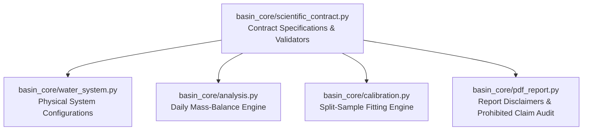

# BASIN Scientific Contract & Hydrologic Experiment Audit

**Document Status:** Implementation-Ready Scientific Specification  
**Governing Standard:** Texas Board of Professional Engineers & Land Surveyors (TBPELS) Practice Standards / TWDB Regional Water Planning Guidelines  
**Current Code Base:** BASIN v2 (`basin-latest` branch `main`)  
**Scope:** Formal audit of the current rainfall-to-storage experiment and exact specifications required prior to introducing catchment weighting, reservoir surface area hypsometry, inflow routing, and calibrated evaporation.

> **CRITICAL SCIENTIFIC PRINCIPLE:**  
> BASIN’s storage-system experiment is an **illustrative screening tool** designed to evaluate relative hydrologic stress across diverse weather scenarios. It strictly enforces mathematical mass conservation ($|\text{Error}| < 10^{-6}\text{ ac-ft}$), but it is **uncalibrated** against historical river streamflow or official state water models. **No uncalibrated proposal shall be presented or claimed as scientifically validated or as an official regulatory forecast.**

---

## 1. Audit of Current Rainfall-to-Storage Implementation

An engineering audit of `basin_core/analysis.py`, `basin_core/water_system.py`, and `docs/methodology.md` reveals five critical mathematical and physical approximations in the current implementation:

### 1.1 Equal-Station Arithmetic Precipitation Aggregation
- **Current Formulation:**
  $$\bar{P}_t = \frac{1}{N} \sum_{i=1}^N P_{i,t}$$
  In `basin_core/analysis.py` line 173: `series.mean(axis=1)` averages daily precipitation equally across all selected stations.
- **Deficiency:**
  The default preset uses three NOAA airport stations: Corpus Christi Intl (`USW00012924`), Victoria Regional (`USW00012935`), and San Antonio Intl (`USW00012921`). These stations reside outside or on the far periphery of the actual drainage basins. Furthermore, the lower Nueces catchment feeding Lake Corpus Christi is **16,656 square miles**, while the Frio catchment feeding Choke Canyon is **5,490 square miles**. Treating precipitation at these disparate locations with equal 33.3% weights introduces substantial spatial distortion and fails to represent actual runoff-generating rainfall over the headwaters.

### 1.2 Instantaneous Linear Inflow Heuristic
- **Current Formulation:**
  $$\text{Inflow}_t = \text{base\_inflow} + \bar{P}_t \times \text{inflow\_sensitivity}$$
  For Texas Region N: $\text{Inflow}_t = 30 + 45 \times \bar{P}_t\text{ [ac-ft/day]}$.
- **Deficiencies:**
  1. **Zero Runoff Physics:** Precipitation is converted directly to acre-feet via an arbitrary linear multiplier ($45\text{ ac-ft/mm}$) rather than a physically grounded runoff coefficient ($C = Q/P$) or Soil Conservation Service Curve Number ($CN$).
  2. **No Antecedent Soil Moisture State:** A 25 mm rainfall event falling on parched, cracked clay loam soils generates near-zero runoff, whereas the same event on saturated ground yields heavy runoff. The current linear equation generates identical inflow regardless of antecedent moisture.
  3. **Zero Travel Lag or Channel Routing:** Rainfall in San Antonio or the Hill Country headwaters is modeled as arriving in Choke Canyon Reservoir on the exact same day ($T_{\text{lag}} = 0$). In reality, flood waves take 3 to 10 days to travel through the Frio and Nueces river channels to the reservoir pools.
  4. **No Baseflow Separation:** Groundwater baseflow is represented as a static constant ($30\text{ ac-ft/day}$) rather than a decaying recession hydrograph.

### 1.3 Lumped Evaporation vs. Surface Area Hypsometry
- **Current Formulation:**
  Potential evaporation is modeled either as a step function:
  $$E_{\text{pot}} = \begin{cases} 750\text{ ac-ft/day} & \text{June–September} \\ 380\text{ ac-ft/day} & \text{October–May} \end{cases}$$
  or with an optional smooth pan curve scaled by a heuristic power law:
  $$\text{EAC\_Scale} = \max\left(0.15, \left(\frac{S_t}{S_{\max}}\right)^{0.65}\right)$$
- **Deficiencies:**
  1. **Arbitrary Power Law:** The exponent $0.65$ is a rough geometric heuristic, not derived from official TWDB volumetric survey hypsometric tables.
  2. **No Net Evaporation:** Real reservoir water accounting balances **gross lake evaporation** ($E_{\text{gross}} = K_{\text{pan}} \times E_{\text{pan}}$) against **direct rainfall on the water surface** ($P_{\text{direct}}$). On a rainy day, direct precipitation on a 40,000-acre lake surface adds thousands of acre-feet directly to storage; the current model subtracts potential evaporation while treating rain only as a lumped watershed inflow.

### 1.4 Rigid Reservoir Allocation
- **Current Formulation:**
  Withdrawals are drawn 65% from Lake Corpus Christi and 35% from Choke Canyon when Lake Corpus Christi is above 20%, shifting to 15% / 85% below 20%.
- **Deficiencies:**
  While illustrative of City of Corpus Christi operating policy, it omits real-world constraints such as the Mary Rhodes Pipeline baseload capacity (70–72 MGD), minimum instream flow requirements, and statutory domestic priority protections (*Tex. Water Code § 11.024*).

---

## 2. Required Scientific & Data Contracts

Prior to implementing physical enhancements in the calculation engine, the following formal contracts must be established in the codebase:

### 2.1 Catchment Weighting Contract (`CatchmentWeightingContract`)
- **Mathematical Form:**
  $$P_{\text{catchment}, t} = \sum_{i=1}^M w_i P_{i, t} \quad \text{subject to} \quad \sum_{i=1}^M w_i = 1.0, \; w_i \ge 0$$
- **Methods Supported:**
  1. `THIESSEN_POLYGON`: Perpendicular bisector area fractions for selected rainfall stations.
  2. `PRISM_GRID_AREA_WEIGHTED`: Spatial overlay of PRISM 4km precipitation grid cells onto USGS HUC-8 watershed boundaries.
- **Required Sub-Basins for Region N:**
  - **Upper/Mid Nueces Basin above Lake Corpus Christi:** Area = 16,656 sq mi.
  - **Frio-Atascosa Basin above Choke Canyon Reservoir:** Area = 5,490 sq mi.

### 2.2 Reservoir Elevation-Area-Capacity (EAC) Hypsometry Contract (`ReservoirEACContract`)
- **Mathematical Form:**
  $$A(S) = a_0 + a_1 S + a_2 S^2 + a_3 S^3 \quad [\text{acres}]$$
  $$Z(S) = b_0 + b_1 S + b_2 S^2 \quad [\text{ft NGVD29}]$$
- **Physical Boundary Invariants:**
  1. $A(0) \ge 0$ and $A(S) > 0$ for $S > 0$.
  2. Monotonicity: $\frac{dA}{dS} > 0$ and $\frac{dZ}{dS} > 0$ across all $S \in [0, S_{\max}]$.
  3. Conservation Cap: $A(S_{\max}) = A_{\text{crest}}$ within $\pm 2.0\%$.
- **Official Texas Water Development Board (TWDB) Survey Anchors:**
  - **Lake Corpus Christi (TWDB 2016 Survey):**
    - Crest Elevation: 94.0 ft NGVD29
    - Conservation Storage: 256,339 acre-feet
    - Surface Area at Crest: 19,748 acres
    - Inactive Pool (Dead Storage): 75,000 acre-feet
  - **Choke Canyon Reservoir (TWDB 2012 Survey):**
    - Crest Elevation: 220.5 ft NGVD29
    - Conservation Storage: 663,400 acre-feet
    - Surface Area at Crest: 25,690 acres
    - Inactive Pool: 0 acre-feet (fully drainable via bottom sluice gates)

### 2.3 Inflow Routing & Runoff Transformation Contract (`InflowRoutingContract`)
- **Mathematical Form (SCS Curve Number Formulation):**
  $$Q_t = \frac{(P_t - I_a)^2}{(P_t - I_a) + S_{\text{pot}}} \quad \text{for } P_t > I_a$$
  where $S_{\text{pot}} = \frac{1000}{CN} - 10$ and initial abstraction $I_a = 0.2 \times S_{\text{pot}}$.
- **Channel Routing Lag (Muskingum / Discrete Travel Time):**
  $$\text{Inflow}_{\text{reservoir}, t} = Q_{\text{base}} + \sum_{\tau=0}^K h_\tau Q_{t - \tau}$$
  where $h_\tau$ is the discrete unit hydrograph kernel and $\sum h_\tau = 1.0$.

### 2.4 Calibrated Net Evaporation Contract (`EvaporationCalibrationContract`)
- **Mathematical Form:**
  $$E_{\text{net}, t} = \max\left(0.0, \; \left(K_{\text{pan}} \times E_{\text{pan}, t} - P_{\text{direct}, t}\right) \times \frac{A(S_t)}{12.0}\right) \quad [\text{ac-ft/day}]$$
  where:
  - $E_{\text{pan}, t}$ is daily pan evaporation depth [in/day] from TWDB Quadrangle records.
  - $K_{\text{pan}}$ is monthly pan-to-lake coefficient ($0.70 \le K_{\text{pan}} \le 0.77$).
  - $P_{\text{direct}, t}$ is direct precipitation depth falling on the lake surface [in/day].
  - $A(S_t)$ is the dynamic water surface area [acres] from the EAC contract.

---

## 3. Required Datasets, Units, and Provenance

The following external datasets are mandatory before any physical model extension can claim calibration:

| Dataset / Parameter | Primary Source Agency | Station / Record Identifiers | Temporal Resolution | Physical Units | Access & Lineage |
|---|---|---|---|---|---|
| **Streamflow (Inflow Benchmarks)** | USGS National Water Information System (NWIS) | 08211000 (Nueces nr Mathis)<br>08206900 (Frio nr Tilden)<br>08210000 (Nueces nr Three Rivers) | Daily mean ($[L^3/T]$) | Cubic feet per second (cfs)<br>$1\text{ cfs} = 1.9835\text{ ac-ft/day}$ | USGS Water Services REST API |
| **Reservoir Elevation & Contents** | Texas Water Development Board (TWDB) | Lake Corpus Christi (`LCC`)<br>Choke Canyon (`CCR`) | Daily midnight observation | Elevation: ft NGVD29<br>Storage: Acre-feet | Water Data for Texas (`waterdatafortexas.org`) |
| **Hydrographic Volumetric Surveys** | TWDB Hydrological Services | TWDB 2016 Survey (LCC)<br>TWDB 2012 Survey (CCR) | Decennial survey report | Hypsometric tables: Elevation [ft], Area [acres], Capacity [ac-ft] | TWDB Lake Survey Reports |
| **Gross Lake Pan Evaporation** | TWDB Water Science & Conservation | Quadrangle 711 & 811 | Monthly historical (1954–present) | Inches per month ($[L]$) | TWDB Lake Evaporation Database |
| **Gridded Precipitation Normals** | PRISM Climate Group (OSU) / NOAA | nClimGrid-Daily / PRISM 4km | Daily gridded | Millimeters / Inches | NOAA NCEI / Oregon State PRISM |
| **Reference ET ($ET_o$)** | Texas ET Network (TAMU AgriLife) | Corpus Christi Station (`CC01`) | Daily calculated | Inches per day ($[L]$) | Texas ET Network API |

---

## 4. Calibration & Validation Benchmarking Protocol

Any proposed calibration of BASIN's rainfall-to-storage engine must adhere to a strict split-sample protocol:

### 4.1 Historical Calibration & Split-Sample Windows
- **Calibration Period (1991-01-01 to 2010-12-31, 20 Years):** Parameter optimization period spanning moderate and wet cycles.
- **Validation Period 1 — Drought of Record (2011-01-01 to 2015-12-31, 5 Years):** The historic 2011 Texas single-year drought and prolonged multi-year drawdown.
- **Validation Period 2 — Modern Day Zero Crisis (2020-01-01 to 2026-06-30, 6.5 Years):** Independent blind test covering the April 2026 all-time low of 7.7% combined storage.

### 4.2 Quantitative Fit Criteria (Mandatory Minimums)
Before any parameter set is approved for production, it must achieve the following statistical thresholds across all validation periods:
1. **Nash-Sutcliffe Efficiency ($NSE$):**
   $$NSE = 1 - \frac{\sum_{t=1}^T \left(S_{\text{obs}, t} - S_{\text{sim}, t}\right)^2}{\sum_{t=1}^T \left(S_{\text{obs}, t} - \bar{S}_{\text{obs}}\right)^2} \ge 0.65$$
2. **Kling-Gupta Efficiency ($KGE$):**
   $$KGE = 1 - \sqrt{(r - 1)^2 + (\alpha - 1)^2 + (\beta - 1)^2} \ge 0.70$$
   where $r$ is the Pearson correlation coefficient, $\alpha = \sigma_{\text{sim}}/\sigma_{\text{obs}}$, and $\beta = \mu_{\text{sim}}/\mu_{\text{obs}}$.
3. **Percent Volume Bias ($PBIAS$):**
   $$|PBIAS| = \left| \frac{\sum_{t=1}^T \left(S_{\text{sim}, t} - S_{\text{obs}, t}\right)}{\sum_{t=1}^T S_{\text{obs}, t}} \times 100 \right| \le 10.0\%$$

---

## 5. Professional Licensing & Statutory Boundaries

### 5.1 Texas Engineering Practice Act (*Tex. Occ. Code § 1001.003*)
- Under Texas law, providing calculations that establish official municipal water yields, water rights allocations, or drought declarations constitutes the practice of professional engineering.
- **Decision-Support vs. Engineering Certification:**
  BASIN is classified as an exploratory screening and scenario-stress workbench. It provides decision-support evidence to inform human reviewers. It does **not** replace licensed engineering judgement.
- **Sign-Off Contract (`ProfessionalApprovalContract`):**
  If a customer or municipality uses BASIN to prepare official water plans or bond disclosures, the output must be reviewed and stamped by a licensed **Texas Professional Engineer (PE)** or **Certified Professional Hydrologist (PH)**.

---

## 6. Prohibited Claims in UI Displays and Exported Reports

The following affirmative claims are strictly **PROHIBITED** in all software interfaces, tooltips, generated PDF briefs, and exported deliverables:

| Prohibited Statement / Pattern | Scientific Rationale | Correct Permissible Framing |
|---|---|---|
| *"BASIN provides official water supply forecasts."* | The model is uncalibrated and illustrative; official forecasts are governed by water utilities and river authorities. | *"BASIN provides illustrative screening scenarios for comparative stress evaluation."* |
| *"Guaranteed Day Zero date: July 14, 2027."* | Reservoir depletion is highly sensitive to unknown future weather, industrial curtailments, and pipeline operations. | *"Projected threshold crossing under configured scenario assumptions (subject to uncertainty)."* |
| *"BASIN replaces the TCEQ Nueces WAM model."* | The Texas Water Availability Model (WAM Run 3) is statutory and enforces legal water rights priority; BASIN does not model individual water rights. | *"BASIN complements WAM analyses by generating auditable dry-weather stress sequences for local review."* |
| *"Scientifically validated / Hydrologist certified."* | Automated numerical consistency tests do not constitute professional hydrologic validation. | *"Numerically verified mass balance; pending formal external domain calibration."* |
| *"Scaling rainfall 50% scales drought severity 50%."* | Hydrologic drought is non-linear; a 50% rainfall reduction often causes an 80–90% streamflow reduction. | *"Rainfall retention scales precipitation volume; non-linear runoff responses require watershed modeling."* |

An automated validator function `validate_report_text_against_prohibited_claims(text)` is implemented in [`basin_core/scientific_contract.py`](file:///c:/Users/sonti/Terminus%20Clone/basin-latest/basin_core/scientific_contract.py) to prevent prohibited claims from being generated in reports.

---

## 7. Owning Module Architecture Mapping

To maintain clean architectural boundaries and avoid god objects or circular dependencies, the proposed scientific contract fields are mapped to owning modules as follows:



| Component / Parameter Field | Future Owning Module | Current Status in Code | Integration Stage |
|---|---|---|---|
| `StationWeight`, `CatchmentWeightingContract` | `basin_core/water_system.py` | Unweighted average in `analysis.py` | Stage 1 |
| `ReservoirEACContract`, $A(S)$ polynomial | `basin_core/water_system.py` | Heuristic power law $s^{0.65}$ | Stage 2 |
| `InflowRoutingContract`, $Q(P, \tau)$ routing | `basin_core/analysis.py` | Linear $30 + 45 R$ | Stage 3 |
| `EvaporationCalibrationContract`, Quad 811 | `basin_core/analysis.py` | Seasonal steps $750/380$ | Stage 4 |
| `CalibrationBenchmarkContract`, NSE / KGE | `basin_core/calibration.py` *(new)* | Uncalibrated | Stage 5 |
| `ProfessionalApprovalContract` | `basin_core/integrity.py` | Workspace review status only | Stage 6 |
| `PROHIBITED_CLAIM_PATTERNS`, claim validator | `basin_core/scientific_contract.py` | Formal validator implemented | Stage 1 (Ready) |

---

## 8. Migration Plan & Backward Compatibility (Schema 2.2 $\to$ Schema 3.0)

1. **Schema 2.2 Preservation:**
   All existing saved sessions, sidecar files, and review decisions remain 100% loadable and replayable without modification.
2. **Graceful Fallback Defaults:**
   When loading a Schema 2.2 session, unpopulated fields fall back to legacy behavior:
   - `catchment_weighting`: defaults to `WeightingMethod.EQUAL_STATION_LEGACY`.
   - `eac_hypsometry`: defaults to `heuristic_power_law`.
   - `inflow_routing`: defaults to `RunoffMethod.EMPIRICAL_SENSITIVITY_LEGACY`.
   - `approval_status`: defaults to `ApprovalStatus.PROVISIONAL_EXPLORATORY`.
3. **Audit Token Preservation:**
   Legacy simulation digests remain valid. Upgrading a run to calibrated Schema 3.0 requires explicit re-execution by the operator.

---

## 9. Staged Implementation Order

```
[Phase 1: Contracts & Disclaimers]  <-- COMPLETED IN THIS CHANGE
   |-- Create basin_core/scientific_contract.py
   |-- Add automated prohibited claims scanner
   |-- Author comprehensive technical audit
   |
[Phase 2: Catchment Weighting & EAC Hypsometry] (Post-T1 Integration)
   |-- Integrate StationWeight into WaterSystemConfig
   |-- Add TWDB 2016/2012 hypsometric curves to Region N preset
   |-- Validate area and storage conservation invariants
   |
[Phase 3: Net Quadrangle Evaporation]
   |-- Integrate TWDB Quad 811 monthly gross pan rates
   |-- Implement gross lake evap minus direct surface precipitation
   |
[Phase 4: Runoff Inflow Routing]
   |-- Implement SCS Curve Number & hydrologic travel lag
   |-- Historical split-sample calibration against USGS streamflow
   |
[Phase 5: Professional Review Token & Schema 3.0 Freeze]
   |-- Integrate PE / PH review token in export packet
   |-- Finalize Schema 3.0 export and replay verification
```
