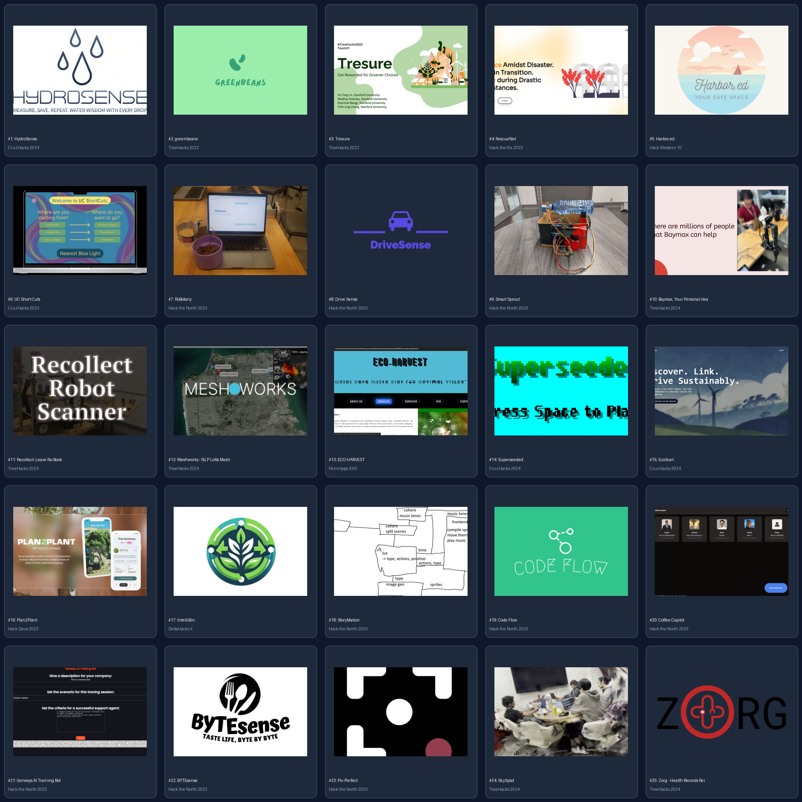

# Hackathon Winner Reference Logos (25 Real Projects)

Curated collection of **25 real winning project logos and thumbnails** downloaded directly from top hackathon winners galleries (Devpost, Hack the North, TreeHacks, PennApps, CruzHacks, HackDavis, DeltaHacks, etc.) for visual design inspiration and brand positioning for **BASIN**.

| # | Project Name | Hackathon Won | Tagline / Focus | Devpost Link | Local File |
|---|--------------|---------------|-----------------|--------------|------------|
| 1 | **HydroSense** | CruzHacks 2024 | Did you know the average American household uses 30,000 gallons of water a year? 20% of that comes from showering. We created a smart IOT showerhead that can fix this issue. | [Devpost](https://devpost.com/software/hydrosense-xbnphl) | [`01_hydrosense.jpeg`](./01_hydrosense.jpeg) |
| 2 | **greenbeans** | TreeHacks 2022 | Sustainable product recommendations as you shop | [Devpost](https://devpost.com/software/greenbeans) | [`02_greenbeans.png`](./02_greenbeans.png) |
| 3 | **Tresure** | TreeHacks 2022 | Get rewarded for greener choices. Tresure provides an environmentally-conscious, rewarding, and exciting shopping experience for users to make greener choices and the sustainable planet a priority. | [Devpost](https://devpost.com/software/tresure) | [`03_tresure.jpeg`](./03_tresure.jpeg) |
| 4 | **RescueNet** | Hack the 6ix 2023 | RescueNet: Safeguarding with subscriptions. Subscribers get temporary housing; homeowners offer support during disasters. | [Devpost](https://devpost.com/software/rescuenet) | [`04_rescuenet.png`](./04_rescuenet.png) |
| 5 | **Harbor.ed** | Hack Western 10 | Feeling lonely with no one to watch out for your emotions? Dive into harbor.ed: Paired with emotion detection through facial recognition and text messages from your sea friends who noticed you're down | [Devpost](https://devpost.com/software/harbor-ed) | [`05_harbored.png`](./05_harbored.png) |
| 6 | **UC Short Cuts** | CruzHacks 2023 | UC Short Cuts, the guide to finding routes around UCSC. Getting to destinations faster encourages walking and reduces our carbon footprint! We hope to make a more eco-friendly and safe environment. | [Devpost](https://devpost.com/software/uc-short-cuts) | [`06_uc_short_cuts.png`](./06_uc_short_cuts.png) |
| 7 | **RoBotany** | Hack the North 2023 | we talk to plants but we not delusional | [Devpost](https://devpost.com/software/the-plant-whisperer) | [`07_robotany.jpg`](./07_robotany.jpg) |
| 8 | **Drive Sense** | Hack the North 2023 | Through CV models and LLMs, we are increasing road safety, and assessing a driver's safety rating, by correlating behavior with the road conditions. | [Devpost](https://devpost.com/software/drive-sense) | [`08_drive_sense.png`](./08_drive_sense.png) |
| 9 | **Smart Sprout** | Hack the North 2023 | Smart Sprout uses real-time soil moisture data and an Arduino-powered motor to precisely deliver water to your plants, ensuring they thrive while giving you live readings of their moisture levels. | [Devpost](https://devpost.com/software/smart-sprout-ponbhq) | [`09_smart_sprout.jpg`](./09_smart_sprout.jpg) |
| 10 | **Baymax, Your Personal Healthcare Companion** | TreeHacks 2024 | Our AI-powered robot arm is a personalized solution to restore physically impaired and elderly individuals’ ability to interact with their environment. | [Devpost](https://devpost.com/software/baymax-your-personal-healthcare-companion) | [`10_baymax_your_personal_healthcare_companion.jpeg`](./10_baymax_your_personal_healthcare_companion.jpeg) |
| 11 | **Recollect: Leave No Book Behind** | TreeHacks 2024 | Our robot scans, digitizes, and analyzes books with zero intervention. | [Devpost](https://devpost.com/software/recollect-ytn0bk) | [`11_recollect_leave_no_book_behind.png`](./11_recollect_leave_no_book_behind.png) |
| 12 | **Meshworks - NLP LoRa Mesh Network for Emergency Response** | TreeHacks 2024 | Imagine an earthquake disabling all telecommunication. We combine mesh-based radio technology with cutting-edge AI processing to build a resilient information network for emergency responders. | [Devpost](https://devpost.com/software/meshworks-nlp-lora-mesh-network-for-emergency-response) | [`12_meshworks___nlp_lora_mesh_network_for_emergency_response.png`](./12_meshworks___nlp_lora_mesh_network_for_emergency_response.png) |
| 13 | **ECO-HARVEST** | PennApps XXIV | Sustainability in farming and local economy | [Devpost](https://devpost.com/software/croprec) | [`13_eco_harvest.jpeg`](./13_eco_harvest.jpeg) |
| 14 | **Superseeded** | CruzHacks 2024 | The world is in need of saving! Save the planet from garbage and pollution by planting seeds and shooting garbage!!! | [Devpost](https://devpost.com/software/superseeded) | [`14_superseeded.png`](./14_superseeded.png) |
| 15 | **EcoScan** | CruzHacks 2024 | Explore products, trace their impact, and joina community dedicated to conscious choices fora greener tomorrow. | [Devpost](https://devpost.com/software/ecoscan-p85m9g) | [`15_ecoscan.png`](./15_ecoscan.png) |
| 16 | **Plan2Plant** | Hack Davis 2023 | A mobile app that aims to bridge the gap between planning and planting by enabling users to efficiently compare the characteristics, intrinsic value, and economic yield of each tree species. | [Devpost](https://devpost.com/software/plan2plant) | [`16_plan2plant.png`](./16_plan2plant.png) |
| 17 | **IntelliBin** | DeltaHacks X | Never Worry About Sorting Your Trash Again – Start Smart Sorting With AI; the Green, Clean, and Smart Way! | [Devpost](https://devpost.com/software/intellibin-4qu7co) | [`17_intellibin.png`](./17_intellibin.png) |
| 18 | **StoryMation** | Hack the North 2023 | Story to Animation in seconds! | [Devpost](https://devpost.com/software/storymation-yvef2p) | [`18_storymation.png`](./18_storymation.png) |
| 19 | **Code Flow** | Hack the North 2023 | Remove the need for tedious onboarding by demystifying new repositories. | [Devpost](https://devpost.com/software/code-flow) | [`19_code_flow.png`](./19_code_flow.png) |
| 20 | **Coffee Copilot** | Hack the North 2023 | Streamline your post-coffee chat routine with Coffee Copilot! We transcribe, summarize, and suggest talking points. Maximize your networking efficiency. | [Devpost](https://devpost.com/software/coffee-copilot) | [`20_coffee_copilot.png`](./20_coffee_copilot.png) |
| 21 | **Genesys AI Training Bot** | Hack the North 2023 | Trains customer service employees with AI and the Genesys API. Can be used to automatically onboard new employees and test how they fit into your company’s values. | [Devpost](https://devpost.com/software/genesys-ai-employee-trainer) | [`21_genesys_ai_training_bot.png`](./21_genesys_ai_training_bot.png) |
| 22 | **BYTEsense** | Hack the North 2023 | Taste Life, Byte by Byte! | [Devpost](https://devpost.com/software/bytesense) | [`22_bytesense.png`](./22_bytesense.png) |
| 23 | **Pic-Perfect** | Hack the North 2023 | AI-powered robot that allows you to take photos of yourself effortlessly. | [Devpost](https://devpost.com/software/picture-perfect-oqgb92) | [`23_pic_perfect.png`](./23_pic_perfect.png) |
| 24 | **SkySplat** | TreeHacks 2024 | drones + gaussian splatting = automated, AI-powered 3D modeling of any environment for disaster recovery, emergency response, and infrastructure inspections | [Devpost](https://devpost.com/software/skysplat) | [`24_skysplat.png`](./24_skysplat.png) |
| 25 | **Zorg - Health Records Reimagined** | TreeHacks 2024 | Automated healthcare with Zorg: secure, decentralized storage and instant access to encrypted patient records, ensuring life-saving info is available in emergencies. | [Devpost](https://devpost.com/software/zorg-7ubd4x) | [`25_zorg___health_records_reimagined.png`](./25_zorg___health_records_reimagined.png) |

## Design Takeaways for BASIN

1. **Iconic App-Store Framing**: Leading teams use bold single-glyph or clean flat geometric emblems with dark contrasting backdrops that look sharp as desktop icons.
2. **Hydrological & Sensor Motifs**: Water and telemetry winners lean heavily into circular flow dynamics, droplet convergence, wave crests, or node meshes.
3. **Two-Tone Color Palettes**: Successful projects stick to 2 (max 3) cohesive tones (e.g. electric cyan + deep navy, or emerald + charcoal), avoiding muddy gradients.
